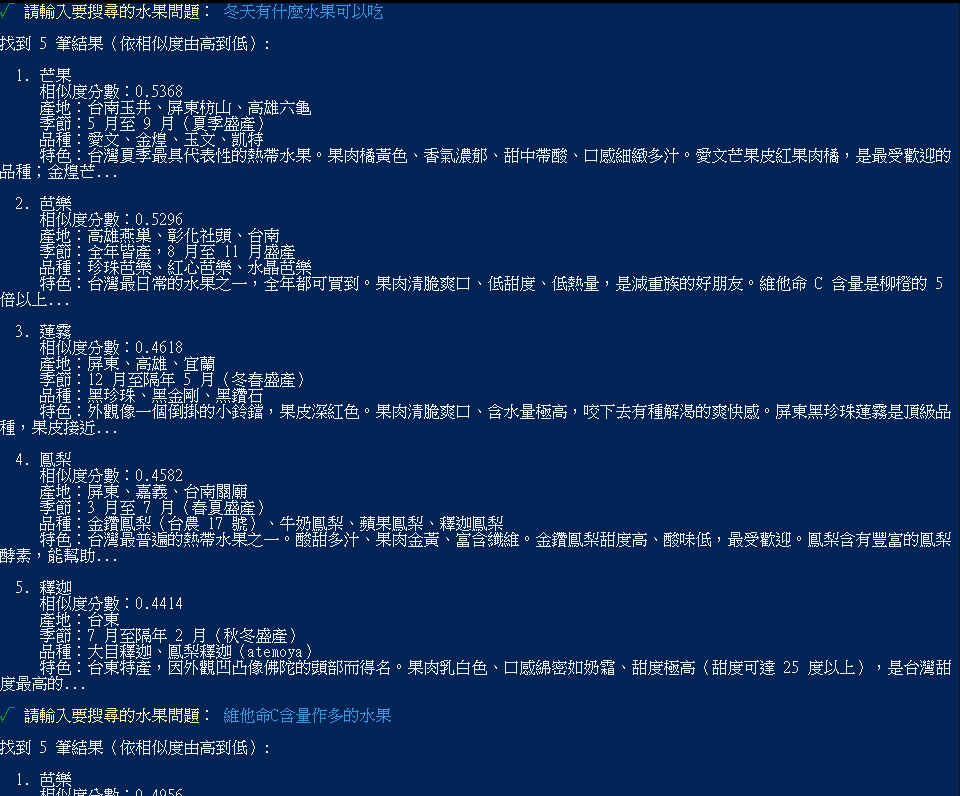

# 作業 3：迷你水果知識庫（RAG + Qdrant）

## 檔案結構

```
ai-agent-hw3/
├── data/fruits.js                # ⭐ 5 筆水果資料 + fruitToText() 文字組合
├── lib/
│   ├── openai.js                 # OpenAI client
│   └── qdrant.js                 # ⭐ Qdrant client + embed() + searchFruits()
├── scripts/embed-fruits.js       # ⭐ 初始化:建集合 → embed → upsert
├── main.js                       # ⭐ 互動式搜尋(仿老師)
├── utils/spinner.js              # CLI 載入動畫
├── config.js                     # 讀 .env(三個環境變數)
├── package.json
├── .env.example / .gitignore
```

## 程式核心

### Embeddings 函數 — [`lib/qdrant.js`](./lib/qdrant.js)

```js
export const EMBEDDING_MODEL = "text-embedding-3-small";
export const EMBEDDING_DIM = 1536;

export async function embed(text) {
  const res = await client.embeddings.create({
    model: EMBEDDING_MODEL,
    input: text,
  });
  return res.data[0].embedding;
}
```

### 知識庫初始化 — [`scripts/embed-fruits.js`](./scripts/embed-fruits.js)

```js
// 流程:刪舊集合 → 建新集合 → 批次 embed → 一次 upsert 5 筆
await recreateCollection();                       // dim=1536, distance=Cosine
const texts = FRUITS.map(fruitToText);           // 每筆水果組合成文字段落
const vectors = await embedBatch(texts);         // 5 筆一次 embed
const points = FRUITS.map((fruit, idx) => ({
  id: fruit.id,
  vector: vectors[idx],
  payload: { name, region, season, varieties, description }
}));
await qdrant.upsert(FRUITS_COLLECTION, { wait: true, points });
```

### 搜尋函數 — [`lib/qdrant.js`](./lib/qdrant.js)

```js
export async function searchFruits(query, limit = 5) {
  const vector = await embed(query);             // 把查詢也轉成向量
  const results = await qdrant.search(FRUITS_COLLECTION, {
    vector,
    limit,
    with_payload: true,                          // 帶回原始資料
  });
  return results.map(r => ({ score: r.score, ...r.payload }));
}
```

## 實測搜尋紀錄

執行截圖：


